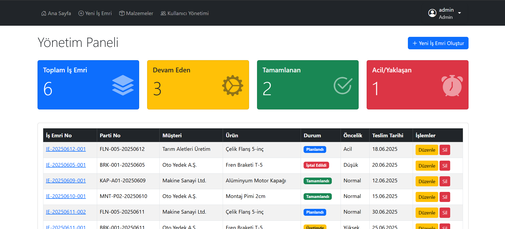
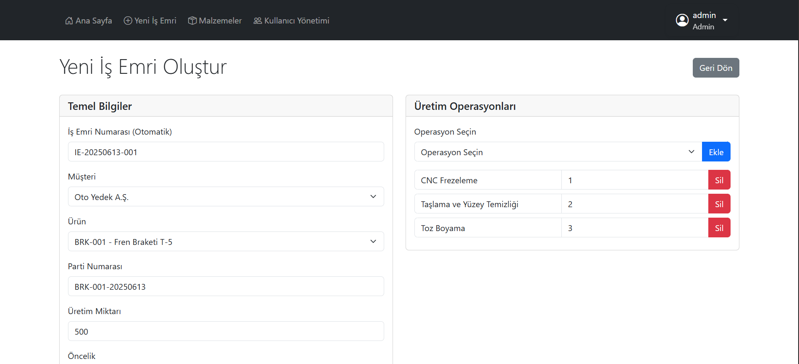

# İmalat İş Emri Yönetim ve Takip Sistemi

**KOBİ Ölçekli Metal İşleme ve CNC Atölyeleri için Yalın ve Etkili bir Çözüm**

  
  

Bu proje, Web Tabanlı Programlama dersi kapsamında, yalın PHP ve MySQL kullanılarak geliştirilmiştir. Proje, küçük ve orta ölçekli imalat atölyelerinin üretim süreçlerini Excel ve kağıt üzerinden dijital bir platforma taşımasını hedefleyerek, verimliliği, izlenebilirliği ve standardizasyonu artırmayı amaçlamaktadır.

---

### 📖 İçindekiler
* [Proje Hakkında](#-proje-hakkında)
* [Öne Çıkan Özellikler](#-öne-çıkan-özellikler)
* [Teknolojiler](#-teknolojiler)
* [Kurulum Adımları](#-kurulum-adımları)
* [Canlı Demo ve Giriş Bilgileri](#-canlı-demo-ve-giriş-bilgileri)
* [Tanıtım Videosu](#-tanıtım-videosu)
* [Ekran Görüntüleri](#-ekran-görüntüleri)

---

### 🎯 Proje Hakkında

Bu sistem, özellikle siparişe dayalı veya partiler halinde üretim yapan **metal işleme, CNC ve imalat atölyeleri** gibi KOBİ'lerin karşılaştığı temel sorunlara çözüm getirmektedir. Excel tabloları, not defterleri ve sözlü talimatlarla yürütülen kaotik iş akışlarının neden olduğu bilgi kaybı, izlenebilirlik eksikliği ve verimsizlik gibi problemleri ortadan kaldırmayı hedefler.

Sistem, tüm iş emirlerini merkezi bir platformda toplayarak, bir işin hangi aşamada olduğunu, kim tarafından üretildiğini, hangi malzemelerin kullanıldığını ve ne zaman teslim edileceğini "bir bakışta" görme imkanı sunar.

---

### ✨ Öne Çıkan Özellikler

* **🔒 Güvenli Kimlik Doğrulama:** `password_hash()` ile korunan şifreler ve `session` tabanlı oturum yönetimi.
* **👑 Rol Bazlı Yetkilendirme:** Sadece **Admin** rolündeki kullanıcıların erişebildiği "Kullanıcı Yönetimi" paneli.
* **📊 Dinamik Dashboard:** Toplam, devam eden, tamamlanan ve teslimatı yaklaşan iş emirlerini gösteren, tıklanarak ilgili listeyi filtreleyen özet kartları ve durum bazlı renklendirilmiş liste.
* **⚙️ Kapsamlı İş Emri Yönetimi:** İş emirleri için tam kapsamlı Oluşturma, Listeleme, Güncelleme ve Silme (CRUD) işlemleri.
* **🔢 Otomatik Numaralandırma:** `IE-YYYYMMDD-NNN` formatında standart ve otomatik artan İş Emri Numaraları ile kurumsal bir yapı.
* **ιχ Gelişmiş İzlenebilirlik:** Her iş emrine özel, ürüne göre otomatik önerilen **Parti Numarası** atama özelliği.
* **📚 Standart Operasyon Kütüphanesi:** Üretim adımlarını kütüphaneden seçerek hızlı, hatasız ve standartlara uygun veri girişi.
* **📦 Malzeme Yönetimi:** Hammadde, tedarikçi ve kalite sertifika bilgilerini yönetmek için ayrı bir CRUD modülü.

---

### 🛠️ Teknolojiler

Proje, harici bir kütüphane veya framework kullanılmadan **yalın (plain)** teknolojilerle geliştirilmiştir:

* **Arka Uç:** PHP 8+
* **Veritabanı:** MySQL
* **Ön Uç:** HTML5, Bootstrap 5, Yalın JavaScript

---

### 🚀 Kurulum Adımları

Projenin yerel bir makinede çalıştırılması için aşağıdaki adımlar izlenmelidir:

1.  Bu repoyu bilgisayarınıza klonlayın veya `.zip` olarak indirin.
2.  `phpMyAdmin` üzerinden `imalat_yonetim_sistemi` adında yeni bir veritabanı oluşturun.
3.  Proje ana dizininde bulunan `imalat_yonetim_sistemi.sql` dosyasını, oluşturduğunuz bu yeni veritabanına "İçe Aktar" (Import) seçeneği ile yükleyin.
4.  `config/` klasörünün içinde bulunan `database.php.example` dosyasının bir kopyasını oluşturun ve adını `database.php` olarak değiştirin.
5.  Oluşturduğunuz `database.php` dosyasını açarak kendi yerel veritabanı bilgilerinizi (`DB_USERNAME`, `DB_PASSWORD` vb.) girin.
6.  Proje artık `localhost` üzerinde çalışmaya hazırdır.

---

### 🌐 Canlı Demo ve Giriş Bilgileri

Projenin canlı demosuna aşağıdaki adresten erişilebilir. Tüm özellikleri test etmek için admin yetkisine sahip kullanıcı ile giriş yapabilirsiniz.

| URL | `http://95.130.171.20/~st24360859935` |
| :--- | :--- |
| **Kullanıcı Adı** | `admin` |
| **Şifre** | `123456` |

---

### 🎬 Tanıtım Videosu

Uygulamanın 1-3 dakikalık kullanımını ve temel özelliklerini gösteren videoya aşağıdaki linkten ulaşabilirsiniz:

➡️ **[Projeyi İncele (YouTube Video Linki)](https://YOUTUBE_VEYA_GOOGLE_DRIVE_LINKINIZI_BURAYA_YAPIŞTIRIN)**

---

### 🖼️ Ekran Görüntüleri

#### **Yönetim Paneli (Dashboard)**
*Ana sayfada yer alan ve işletmenin anlık durumunu özetleyen, tıklanabilir kartlar ve filtrelenebilir iş emri listesi.*

#### **İş Emri Detay Sayfası**
*Bir iş emrine ait tüm genel bilgileri, üretim operasyonlarını ve durumlarını gösteren detaylı görünüm.*

